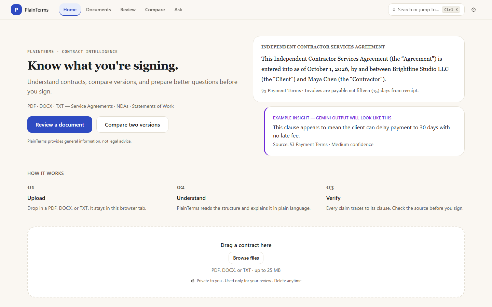
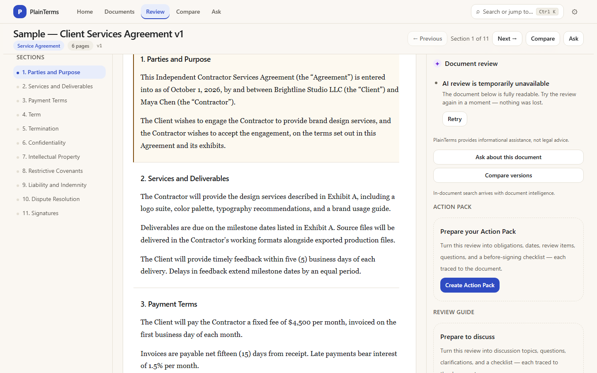
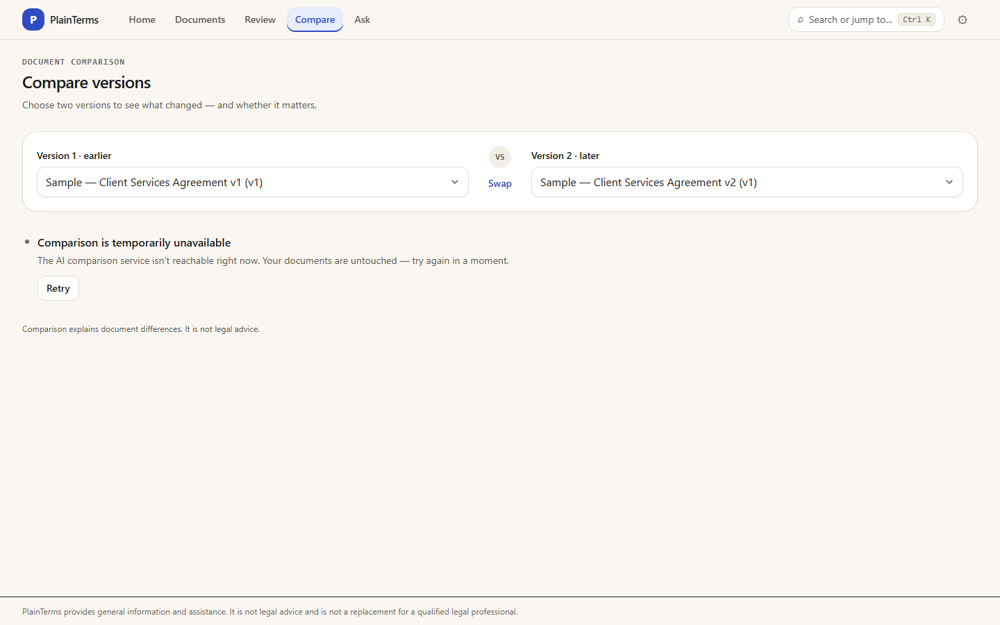
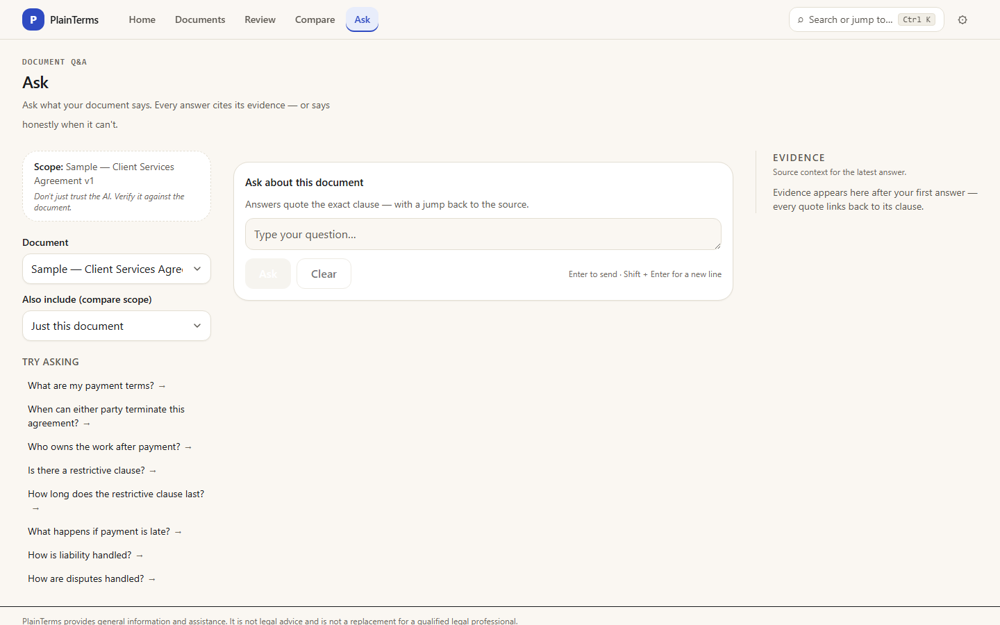
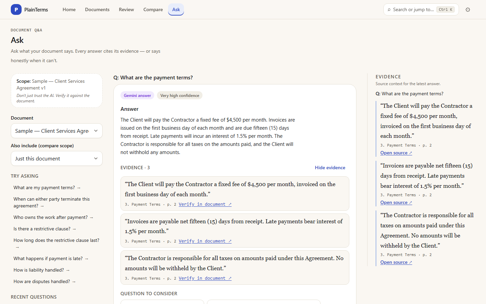
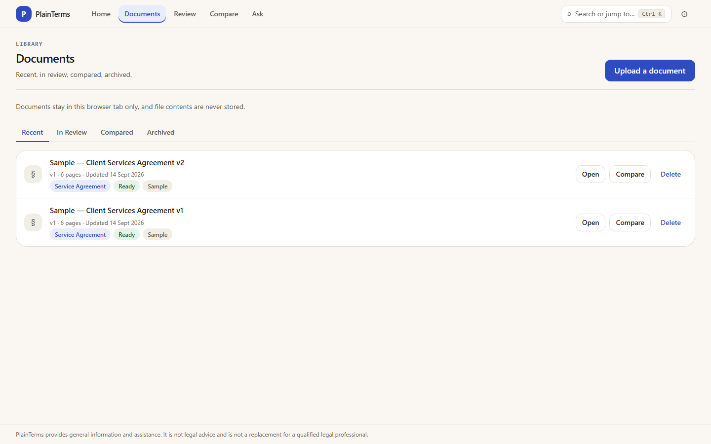

# PlainTerms — Know what you're signing.

Freelancers routinely sign client contracts they cannot fully understand:
payment terms buried on page 14, IP clauses that decide who owns the work,
silent redlines between versions. Lawyers cost more than the gig pays.
PlainTerms turns a real contract into plain-language meaning — what you owe,
what you risk, what changed, and what to ask — with every claim traced to
the exact clause it came from.

> PlainTerms provides general information and assistance. It is not legal
> advice and is not a replacement for a qualified legal professional.

## Target user

Freelancers reviewing **Service Agreements**, **NDAs**, and **Statements
of Work** — people who sign contracts monthly, negotiate over email, and
cannot spend $300 on counsel for every deal.

## Why Gemini is necessary (not rules or search)

Contracts paraphrase the same obligation a dozen ways ("work for hire" vs
"hereby assigns"), ask open-ended questions over 15 pages, and hide
_material_ changes inside reworded versions. No template, regex set, or
keyword index covers that. PlainTerms uses **Gemini 2.5 Flash** for:

- **Document understanding** — parties, exchange of value, headline terms
  across arbitrary layouts.
- **Clause intelligence** — semantic classification of payment, IP,
  termination, liability, and 7 more categories across paraphrase.
- **Evidence-grounded Q&A** — open questions answered only from retrieved
  context, with citations, confidence, and silence detection.
- **Semantic comparison** — same/changed/added/removed by _meaning_, with
  a plain-language verdict on which version favors the freelancer.
- **Silence detection** — what disappeared between versions, classified as
  removed / not found / uncertain (never conflated).
- **Action Pack + Review Guide** — obligations, dates, negotiation
  preparation, and lawyer questions synthesized from validated findings.

A traditional text diff shows _what_ changed; PlainTerms shows _whether it
matters and to whom_ — e.g. NET 15 → NET 30 is one line in a diff and a
cash-flow event in reality.

## Features

- Upload PDF, DOCX, or TXT (magic-byte verified, parsed server-side)
- Plain-language summary, clause cards, obligations, key dates
- Document Q&A with evidence chips that jump to the source clause
- V1-vs-V2 semantic redlines with dual evidence navigation
- Action Pack (obligations, dates, checklists, lawyer brief; copy/print)
- Review Guide (discussion topics, neutral questions, counsel quarantine)
- Seeded V1/V2 demo contracts — the "v2 ambush" runs with no setup

## Demo flow

Upload → Understand → Ask → Compare → find the **v2 ambush** (Net 15→30,
non-compete 6→12 months, removed late-fee language) → Action Pack →
Review Guide. With `GEMINI_API_KEY` set, every step is live; without it,
document flows still run and AI surfaces explain themselves honestly.








## Safety

Five visually distinct information layers (document fact, AI
interpretation, background, potential option, counsel-quarantined); every
AI claim carries evidence or is dropped by the citation-or-silence guard;
confidence and ambiguity are first-class UI; banned conclusive language is
prohibited by prompt rules and verified by search. The document is always
authoritative — "don't just trust the AI, verify it."

## Technical architecture

Next.js 16 (App Router) + strict TypeScript + Tailwind v4 tokens. Server
routes keep the Gemini key server-side; `POST /api/*` endpoints serve
analysis, Q&A, comparison, packs, guides, and uploads. Parsers (unpdf,
mammoth, strict UTF-8) normalize to one `DocumentContent` shape behind a
fixture-or-record resolver. Zod validates every model response; evidence
is re-validated against source text; versioned caches + in-flight dedup
prevent repeat spend. Fixed-window rate limiting guards `/api/*`
(10/min uploads, 60/min otherwise). Tests: Vitest unit/component/
integration + Playwright e2e + axe scans + production build.

## Supported documents and types

- Files: PDF (text layer), DOCX, TXT — 25 MB, 200 pages, 60s budget.
- Legal types: Service Agreements, NDAs, Statements of Work.
- No OCR: scanned PDFs report an honest no-text state.

## Setup

```bash
npm install
npm run dev        # http://localhost:3000
```

Environment (`.env.local`, never committed):

```bash
GEMINI_API_KEY=your-key-here
```

Without the key, document flows work and AI surfaces show honest
unavailable states. Scripts: `dev`, `build`, `start`, `lint`,
`format`, `typecheck`, `test`, `test:e2e`, `validate`. Test fixtures:
`node scripts/generate-test-fixtures.mjs`.

## Testing

`tests/unit` (logic, prompts, schemas, validators), `tests/integration`
(mocked-provider pipelines, real-file ingestion), `tests/components`
(behavior, keyboard, states), `tests/e2e` (journeys incl. real uploads,
axe scans gating serious/critical). 195 unit + 29 e2e at release.

## Limitations (honest)

- Live Gemini verification pending (no key in CI); mocked coverage
  throughout, manual checklist in DEVELOPMENT.md.
- No OCR; server records are in-memory with 60-min TTL (see Vercel note
  in ARCHITECTURE.md); no antivirus beyond format validation; basic
  per-instance rate limiting only.
- PlainTerms is information and assistance — never legal advice.

## Live demo

Vercel URL: PENDING (see SUBMISSION_READY.md).

## GitHub

Repository: PENDING (single-branch release in progress — see SUBMISSION_READY.md).
